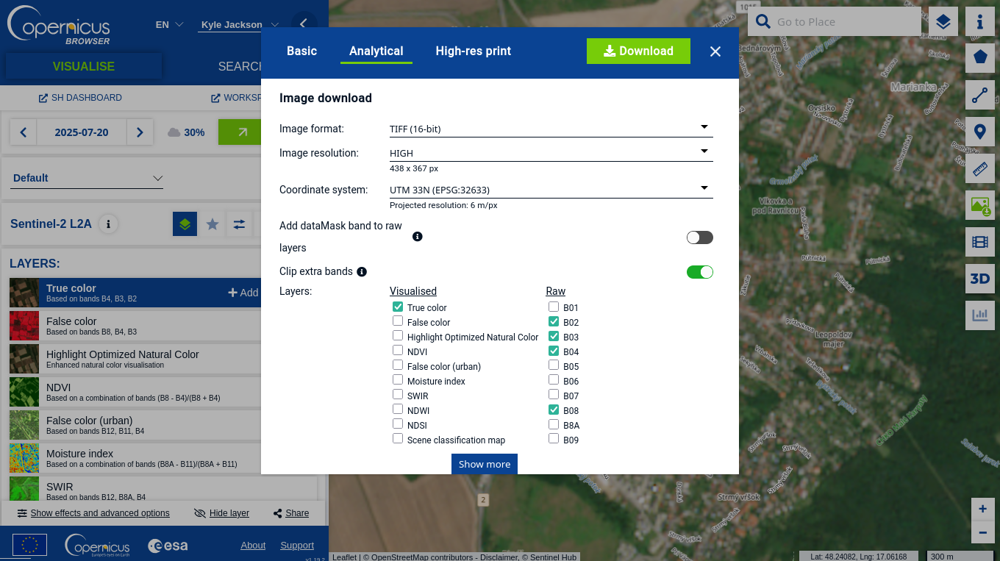

# Sentinel-2 Super-Resolution GUI

A simple, user-friendly desktop application to increase the resolution of Sentinel-2 satellite images.

This tool takes the standard 10-meter Blue, Green, Red, and Near-Infrared (NIR) bands and uses a pre-trained AI model to create a higher-resolution, 2x upscaled image. It's designed for users who want to easily enhance their satellite imagery without complex command-line tools.

.png)

***

## TL;DR (For the Impatient)

1.  **Install stuff**: `pip install pyqt5 torch safetensors rasterio pillow numpy`
2.  **Get the Model**: Download the `REC_Real_L1B.safetensors` file from [Releases](https://github.com/Topping1/L1BSR-GUI/releases/download/alpha1/REC_Real_L1B.safetensors).
3.  **Run the App**: `python l1bsr_sr_gui_updated.py`
4.  **Load Data**: Select the model file and your four Sentinel-2 band files (B02, B03, B04, B08). The app is meant to be used for Sentinel-2 data downloaded from [Copernicus Browser](https://browser.dataspace.copernicus.eu/). The band files requirements are:
   - Image format: TIFF (16-bit)
   - Image resolution: HIGH
   - Coordinate system: UTM (not tested on other systems available in Copernicus Browser but they might work)
   - Layers (Raw): B02, B03, B04, B08.
   - Layers (Visualised): True color (optional). 



5.  **Process**: Click the "Process" button.
6.  **Save**: Save your beautiful new high-resolution image as a GeoTIFF or a JPG.

***

## Features

*   **2x Super-Resolution**: Upscales 10m Sentinel-2 bands (B02, B03, B04, B08) to a higher resolution.
*   **Graphical User Interface**: No command line needed! A simple point-and-click interface.
*   **Interactive Preview**:
    *   See a large preview of your final, upscaled image.
    *   **Click and hold** on the preview to instantly see the "before" image for a quick comparison.
    *   Use the scrollbars to pan across the entire image if it's large.
*   **Visual Sharpening**: Optionally apply an Unsharp Mask filter to the preview and JPG output to make details pop.
*   **Flexible Output Formats**:
    *   **GeoTIFF**: Save the full 4-band (B,G,R,NIR) output with all geographic data preserved. This is the best option for scientific use.
    *   **JPG + JGW**: Save a visually-appealing 3-band (RGB) image with an accompanying world file (`.jgw`) for use in GIS software.

## Requirements

You will need Python 3 and the following libraries, which can be installed easily using `pip`:

```
pip install pyqt5 torch safetensors rasterio pillow numpy
```
**For GPU Acceleration (Optional but Recommended)**: If you have an NVIDIA graphics card, make sure you install a version of PyTorch that supports CUDA. This will make the processing significantly faster.

## How to Use

1.  **Place the Model File**: For convenience, create a folder named `trained_models` in the same directory as the script and place the `REC_Real_L1B.safetensors` file inside it. The app will find it automatically on startup.
    ```
    - your_project_folder/
      |- l1bsr_sr_gui_updated.py  (this script)
      |- trained_models/
         |- REC_Real_L1B.safetensors
    ```
    If you place the model elsewhere, you can select it manually using the "Browse..." button.

2.  **Launch the Application**: Run the script from your terminal:
    ```bash
    python l1bsr_sr_gui_updated.py
    ```

3.  **Select Input Bands**: Click the "Select B02...", "Select B03...", etc., buttons to load your four input GeoTIFF files. A small preview of each band will appear. The files must have the same dimensions and geographic projection.

4.  **Process the Image**: Click the big **"Process (2x Super-Resolution)"** button. Wait a few moments (it will be much faster with a GPU). When it's done, the upscaled RGB preview will appear in the output window.

5.  **Preview and Sharpen**:
    *   Click and hold the mouse on the output image to compare it with the original.
    *   To make the image look sharper, check the "Sharpen" box and adjust the slider. This only affects the preview and the final JPG, not the scientific GeoTIFF data.

6.  **Save Your Output**:
    *   Click **"Save as GeoTIFF..."** to save the pure, 4-band scientific data.
    *   Click **"Save as JPG + JGW..."** to save a visually-ready 3-band image for reports or simple GIS viewing.

## Attribution and License

This application's user interface and workflow are built upon the core model and concepts from the **L1BSR project**. The AI model architecture (`RCAN`) and processing logic are derived from their original work.

*   **Original Repository**: [https://github.com/centreborelli/L1BSR](https://github.com/centreborelli/L1BSR)

This work, like the original it is based on, is licensed under the **GNU General Public License v3.0**.
